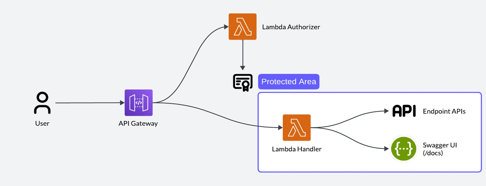

# Setup AWS Lambda and API Gateway

This tutorial will guide you through the process of setting up AWS Lambda and API Gateway.



## Prerequisites

-   AWS Account
-   AWS CLI
-   Python 3.10
-   Clone the initial repository: https://github.com/PassgenixTeam/aws-api-gateway-lambda

## Steps

### Create a Lambda Function for handling API Gateway Request

This lambda function will be used to handle the API Gateway request.

1. Open the [Lambda Console](https://console.aws.amazon.com/lambda).

2. Click on `Create function`.

3. Select `Author from scratch`.

4. Enter the function name, select `Python 3.10` as the runtime and click on `Create function`.

On the function page, you can see the function details and the code editor.

5. Upload the `lambda-handler` folder to the lambda function.

```bash
cd lambda-handler
```

6. Click on `Deploy` to deploy the function.

7. Set timeout to 2 minutes.

8. Setup permissions if the function needs to access other AWS services.

### Create a Lambda Function for authorizer

This lambda function will be used to authorize the API Gateway request.

In this case I are using a **simple authorizer** that checks if the request has a valid token.

The authorization method I am using is **Basic Auth**.

1. Do the same steps as above to create a new lambda function.

2. Upload the `lambda-authorizer` folder to the lambda function.

```bash
cd lambda-authorizer
```

3. Don't forget to deploy the function.

### Create a API Gateway

1. Open the [API Gateway Console](https://console.aws.amazon.com/apigateway).

2. Click on `Create API`.

3. Select `HTTP API` and click on `Build`.

4. Enter the API name and click on `Create`.

5. Click on `Routes` and then `Create`.

6. Enter the route name, select the method and integration type as `Lambda Function`.

7. Select the lambda function created earlier and click on `Create`.

8. Click on `Authorizers` and then `Create`.

9. Enter the authorizer name, select the lambda function created earlier and click on `Create`.

10. Click on `Routes` and then `Edit` the route created earlier.

11. Select the authorizer created earlier and click on `Save`.

### Setup CORS

1. Click on `CORS` and then `Configure`.

2. Enter the allowed origin, methods and headers.

Example:

-   Access-Control-Allow-Origin: `*`
-   Access-Control-Allow-Methods: `GET, POST, PUT, DELETE`
-   Access-Control-Allow-Headers: `Content-Type, Authorization`
-   Access-Control-Expose-Headers: `X-Your-Custom-Header`
-   Access-Control-Max-Age: `300`

3. Click on `Save`.

Now your API Gateway can be accessed from any origin.

### Setup Swagger UI

If you don't have a Swagger UI, you can create one using the API Gateway.

1. Click on `Stages` and then `Create`.

2. Enter the stage name and click on `Create`.

3. Click on `Stages` and then `Deploy`.

4. Select the stage created earlier and click on `Deploy`.

5. Click on `Stages` and then `Export`.

6. Select `Swagger` and click on `Export`.

7. Click on `Stages` and then `SDK Generation`.

8. Select the SDK language and click on `Generate SDK`.

Now you have a Swagger UI specification file that can be used to test your API.
Let's implement Swagger UI to your API Gateway.

1. Open the [Lambda Console](https://console.aws.amazon.com/lambda).

2. Go to the lambda function for API handler created earlier.

3. Change `assets/swagger-spec.json` to the Swagger UI specification file.

4. Open the [API Gateway Console](https://console.aws.amazon.com/apigateway).

5. Go to `Routes`, then create `/docs` and `/assets/{proxy+}` route.

6. Integrate with the lambda function created earlier.

Now you have a Swagger UI that can be accessed from `/docs` route.

## Test the API

Go to `/docs` by default to view Swagger UI and test the API.

The Swagger UI have Basic Auth enabled by default.

-   Username: `admin`
-   Password: `admin`
